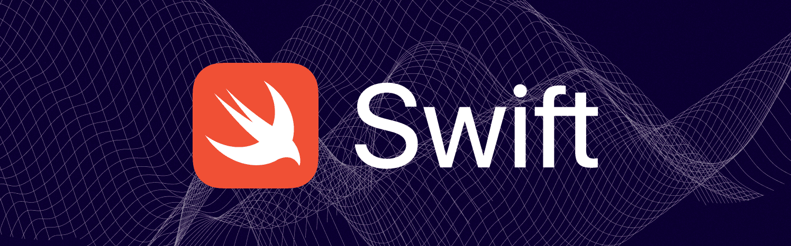

# Оглавление
1. [Основы Swift](#основы-swift)
    - [var vs let](#var-vs-let)
    - [Основные типы данных](#основные-типы-данных)
    - [Логические операторы](#логические-операторы)
2. [Операторы диапазона](#операторы-диапазона)
    - [Оператор замкнутого диапазона](#оператор-замкнутого-диапазона)
    - [Оператор полузамкнутого диапазона](#оператор-полузамкнутого-диапазона)
    - [Односторонние диапазоны](#односторонние-диапазоны)
3. [Опционалы](#опционалы)
    - [Введение в опциональные типы и nil](#введение-в-опциональные-типы-и-nil)
    - [Optional Binding](#optional-binding)
    - [Force Unwrapping](#force-unwrapping)
    - [Nil Coalescing Operator (??)](#nil-coalescing-operator)
4. [Cтроки](#cтроки)
    - [Основные свойства и методы](#основные-свойства-и-методы)
    - [Конкатенация](#конкатенация)
    - [Интерполяция](#интерполяция)
5. [Массивы](#массивы)
    - [Основные операции с массивами](#основные-операции-с-массивами)
    - [Основные свойства и методы массивов](#основные-свойства-и-методы-массивов)
6. [Словарь (Dictionary)](#словарь-dictionary)
    - [Основные методы словарей](#основные-методы-словарей)
    - [Перебор словаря](#перебор-словаря)
    - [Создание словаря из массивов](#создание-словаря-из-массивов)
7. [Инструкция if](#инструкция-if)
8. [Инструкция switch](#инструкция-switch)
    - [Использование диапазонов](#использование-диапазонов)
    - [Сопоставление с кортежами](#сопоставление-с-кортежами)
    - [Связывание значений](#связывание-значений)
    - [Операторы охранного диапазона where](#операторы-охранного-диапазона-where)
9. [Кортежи (Tuples)](#кортежи-tuples)
10. [Циклы](#циклы)
    - [Цикл For-In](#цикл-for-in)
    - [Цикл While](#цикл-while)
    - [Цикл Repeat-While](#цикл-repeat-while)
    - [Контроль выполнения цикла](#контроль-выполнения-цикла)
11. [Функции](#функции)
    - [Дополнительно о параметрах функции](#дополнительно-о-параметрах-функции)
    - [Функция как значение. Тип функции](#функция-как-значение-тип-функции)
    - [Перегрузка функций](#перегрузка-функций)
    - [inout](#inout)

## Основы Swift
### `var` vs `let`

- `var`: Для переменных. Значение может быть изменено.
- `let`: Для констант. Значение не может быть изменено после инициализации.
```swift
var variable = "Изменяемая"
let constant = "Неизменяемая"
```

### Основные типы данных
- `Character` - символ
- `String` - текстовая строка
- `Int` - целое число
- `UInt` - беззнаковый тип целого числа
- `Float` - 32-битное число с плавающей точкой
- `Double` - 64-битное число с плавающей точкой
- `Bool` - логическое значение (true/false)

Вы можете добавить обозначение типа, когда объявляете константу или переменную, чтобы иметь четкое представление о типах значений, которые могут хранить константы или переменные, но это необязательно.

> **Примечание**  
>
> В случае с `Character`, `UInt` и `Float` тип данных необходимо задавать явно.

Пример явного обозначения типа:
```swift
// «Объяви переменную с именем welcomeMessage, тип которой будет String»
var welcomeMessage: String
```

Для изменения типа данных переменной в Swift используется процесс, известный как "type casting" (приведение типов):
```swift
let initialNumber = 123
let stringNumber = String(initialNumber) // Преобразование Int в String
```

### Логические операторы
Логические операторы позволяют выполнять операции с булевыми значениями (`true` или `false`). В Swift основные логические операторы включают в себя:

- Логическое И (AND)`&&`: Возвращает `true`, если оба операнда истинны.
```swift
let isTrue = true && true // true
let isFalse = true && false // false
```

- Логическое ИЛИ (OR) `||`: Возвращает `true`, если хотя бы один из операндов истинен.
```swift
let isTrue = true || false // true
let isFalse = false || false // false
```

- Логическое НЕ (NOT) `!`: Инвертирует значение операнда.
```swift
let isTrue = !false // true
let isFalse = !true // false
```

#### Запятая как логическое И
В Swift запятая , используется в качестве логического оператора И в определённых контекстах, например, в условиях `if`, `guard` и `while`. Это позволяет проверять несколько условий последовательно. Если условие перед запятой ложно, последующие условия не проверяются.
```swift
let age = 20
let hasPermission = true

if age >= 18, hasPermission {
    print("Доступ разрешен")
} else {
    print("Доступ запрещен")
}
```

В этом примере, если `age >= 18` и `hasPermission` оба истинны, выводится "Доступ разрешен". Если первое условие (`age >= 18`) ложно, второе условие (`hasPermission`) не проверяется.

## Операторы диапазона
В языке Swift есть два оператора диапазона, которые в короткой форме задают диапазон значений

### Оператор замкнутого диапазона
Оператор замкнутого диапазона (`a...b`) задает диапазон от `a` до `b`, включая сами `a` и `b`. При этом значение `a` не должно превышать `b`.

Оператор замкнутого диапазона удобно использовать при последовательном переборе значений из некоторого диапазона, как, например, в цикле `for-in`:
```swift
for index in 1...5 {
    print("\(index) умножить на 5 будет \(index * 5)")
}
// 1 умножить на 5 будет 5
// 2 умножить на 5 будет 10
// 3 умножить на 5 будет 15
// 4 умножить на 5 будет 20
// 5 умножить на 5 будет 25
```

### Оператор полузамкнутого диапазона
Оператор полузамкнутого диапазона (`a..<b`) задает диапазон от `a` до `b`, исключая значение `b`. Такой диапазон называется полузамкнутым, потому что он включает первое значение, но исключает последнее

Операторы полузамкнутого диапазона особенно удобны при работе с массивами и другими последовательностями, пронумерованными с нуля, когда нужно перебрать элементы от первого до последнего:
```swift
let names = ["Anna", "Alex", "Brian", "Jack"]
let count = names.count

for i in 0..<count {
    print("Person \(i + 1) будет \(names[i])")
}
// Person 1 будет Anna
// Person 2 будет Alex
// Person 3 будет Brian
// Person 4 будет Jack
```

### Односторонние диапазоны
Операторы замкнутого диапазона имеют себе альтернативу - это диапазон, который продолжается насколько возможно, но только в одну сторону:
```swift
let names = ["Anna", "Alex", "Brian", "Jack"]

for name in names[2...] {
    print(name)
}
// Brian
// Jack
```

Оператор полузамкнутого диапазона так же имеет одностороннюю форму, которая записывается только с одним конечным значением:
```swift
for name in names[..<2] {
    print(name)
}
// Anna
// Alex
```

Вы так же можете проверить имеет ли односторонний диапазон конкретное значение:
```swift
let range = ...5
range.contains(7)   // false
range.contains(4)   // true
range.contains(-1)  // true
```

## Опционалы
### Введение в опциональные типы и nil
Опциональные типы в `Swift` представляют значения, которые могут быть либо иметь значение, либо отсутствовать (т.е., быть `nil`). Опциональные типы выступают как обертки над базовыми типами, добавляя возможность представления отсутствия значения. 

Опционал объявляется с добавлением вопросительного знака `?` к типу данных. Например, `Int?` или `String?`. Это показывает, что переменная может содержать значение соответствующего типа или быть `nil`.

```swift
var number: Int? = 12
number = nil  // теперь number равно nil
```

> Значение `nil` может применяться только к объектам опциональных типов.

> Работая с опциональными типами, важно помнить, что они не эквивалентны обычным типам. Для использования значения опционала его необходимо "развернуть".

### Optional Binding
Optional Binding используется для безопасного извлечения значения из опционального типа. Это делается с помощью конструкций `if let` или `guard let`. Этот метод предпочтителен, так как он предотвращает ошибки времени выполнения, которые могут возникнуть при принудительном извлечении (`force unwrapping`).

Пример:
```swift
var optionalNumber: Int? = Int("123")

if let number = optionalNumber {
    print("У нас есть число: \(number)")
} else {
    print("Не удалось преобразовать строку в число")
}
```
В этом примере, если `optionalNumber` содержит значение, оно присваивается `number` внутри блока `if`, иначе выполняется блок `else`.

### Force Unwrapping
`Force Unwrapping` используется для принудительного извлечения значения из опционального типа. Это делается путем добавления `!` после опционального значения. Однако, этот метод может привести к ошибке времени выполнения, если опциональное значение равно `nil`.

Пример:
```swift
var optionalNumber: Int? = Int("123")

// Опасно: может вызвать ошибку времени выполнения, если optionalNumber == nil
let number = optionalNumber!
print("Число: \(number)")
```

### Nil Coalescing Operator (??)
`Nil Coalescing Operator (??)` используется для предоставления значения по умолчанию в случае, если опциональное значение равно `nil`. Это помогает избежать принудительного извлечения и предоставляет альтернативное значение, если опциональное значение отсутствует.

Пример:
```swift
var optionalNumber: Int? = Int("abc") // nil, так как "abc" не может быть преобразовано в Int

// Возвращает optionalNumber, если оно не nil, иначе возвращает 0
let number = optionalNumber ?? 0
print("Число: \(number)") // 0
```
В этом примере, если `optionalNumber` равно `nil`, оператор `??` предоставляет значение 0.

## Cтроки
### Основные свойства и методы
В `Swift` строка представляет собой упорядоченную коллекцию символов, аналогичную массиву. Строки в `Swift` определяются как `String` и представлены двойными кавычками `""`. Например: `"Hello, World!"`.

> Каждый символ в строке — это отдельный `Character`.

- `.isEmpty`: Проверяет, пустая ли строка, возвращает `Bool` значение.
- `.count`: Возвращает число символов в строке.
- `.startIndex`: Индекс первого символа строки.
- `.endIndex`: Позиция после последнего символа строки. Этот индекс не может быть использован для доступа к символам, так как он выходит за пределы диапазона.

Из-за того, что символы могут занимать разное количество памяти, нельзя получить доступ к символу строки напрямую по индексу. Вместо этого используются специальные методы для работы с индексами:
- `.insert(_:at:)`: Вставляет символ в указанную позицию.
- `.insert(contentsOf:at:)`: Вставляет строку в указанную позицию.
- `.remove(at:)`: Удаляет символ в указанной позиции.
- `.removeSubrange(_:)`: Удаляет подстроку в указанном диапазоне.

#### Многострочные Строки
Для создания многострочных строк используются тройные кавычки `"""`:
```swift
let multilineString = """
Это пример
многострочной строки
в Swift.
"""
```

#### Unicode и Символы
`Swift` полностью поддерживает `Unicode`, что позволяет включать в строки любые `Unicode`-символы:
```
let emojiString = "Пицца 🍕"
```

### Конкатенация
Значения типа `String` можно объединять с помощью оператора `+`:
```swift
let string1 = "hello"
let string2 = " there"
var welcome = string1 + string2
// welcome равен "hello there"
```

### Интерполяция
Интерполяция позволяет создать новую строку из различных значений:
```swift
let multiplier = 3
let message = "\(multiplier) times 2.5 is \(Double(multiplier) * 2.5)"
// "3 times 2.5 is 7.5"
```

## Массивы
Массивы в `Swift` - это упорядоченные коллекции с элементами одного типа, где каждый элемент имеет конкретный порядковый номер или индекс.

### Основные операции с массивами
#### Создание массива
```swift
var someInts = [Int]()  // Создает пустой массив Int
var moreInts: [Int] = [10, 20, 30]  // Создает массив с начальными значениями
```

#### Добавление элементов
```swift
someInts.append(3)  // Добавляет 3 в конец someInts
moreInts += [40, 50]  // Добавляет 40 и 50 в конец moreInts
```

#### Получение и изменение значений
```swift
let firstNumber = moreInts[0]  // Получает первый элемент
moreInts[1] = 25  // Изменяет второй элемент на 25
```

#### Перебор элементов массива
```swift
for item in moreInts {
    print(item)
}
```

Перебор с Индексом:
```swift
for (index, value) in moreInts.enumerated() {
    print("Item \(index + 1): \(value)")
}
```

Перебор с диапазоном:
```swift
let fruits = ["Яблоко", "Банан", "Груша", "Апельсин", "Киви"]
for i in 0..<fruits.count {
    print("Фрукт \(i): \(fruits[i])")
}
```

### Основные свойства и методы массивов
- `count`: Возвращает количество элементов в массиве.
- `.isEmpty`: Проверяет, пуст ли массив.
- `.first`, `.last`: Получает первый или последний элемент (опционально).
- `.append(_:)`: Добавляет новый элемент в конец массива.
- `.insert(_:at:)`: Вставляет новый элемент на указанную позицию.
- `.remove(at:)`: Удаляет элемент на указанной позиции.
- `.sort()`: Сортирует массив на месте.
- `.filter(_:)`: Возвращает новый массив, содержащий элементы, удовлетворяющие условию фильтрации.
- `.map(_:)`: Преобразует каждый элемент массива и возвращает новый массив преобразованных значений.
- `.reduce(_:_:)`: Объединяет все элементы массива в одно значение, используя заданную функцию.

Примеры применения методов:
```swift
let sum = moreInts.reduce(0, +)  // Суммирует все элементы массива
let filtered = moreInts.filter { $0 > 25 }  // Фильтрует элементы, больше 25
let doubled = moreInts.map { $0 * 2 }  // Удваивает каждый элемент
```

## Словарь (Dictionary)
Словарь в Swift - это коллекция пар "ключ-значение", где каждый ключ уникален. Словари используются, когда необходимо получить значение по какому-либо идентификатору (ключу).

Словарь обычно обеспечивает более быстрый доступ к данным по сравнению с массивом, особенно когда речь идет о больших объемах данных. Это связано с тем, что словарь позволяет быстро находить элементы по их уникальным ключам. Также в Swift словари не сохраняют порядок элементов.

> В Swift 5.0 и новее, также доступен тип `OrderedDictionary`, который сочетает в себе характеристики обычных словарей и массивов, сохраняя порядок вставки элементов. Это может быть полезно, когда вам нужно как сохранение порядка, так и быстрый доступ к элементам по ключам

**Пустой словарь**
```swift
var emptyDictionary1: [String: Int] = [:]

var emptyDictionary2 = [String: String]()   // Альтернативный вариант
```

**Словарь с начальными значениями**
```swift
var fruitCalories = ["Яблоко": 52, "Банан": 89]
```

### Основные методы словарей
#### Добавление и изменение значения
```swift
fruitCalories["Апельсин"] = 47  // Добавление новой пары

fruitCalories["Банан"] = 95     // Изменение значения для существующего ключа
fruitCalories.updateValue(95, forKey: "Банан") // Альтернативный вариант
```

#### Удаление пары
```swift
fruitCalories["Яблоко"] = nil   // Удаляет пару "Яблоко": 52

fruitCalories.removeValue(forKey: "Яблоко") // Альтернативный вариант
```

#### Получение значения
```swift
if let appleCalories = fruitCalories["Яблоко"] {
    print("Калорий в яблоке: \(appleCalories)")
}
```

### Перебор словаря
#### Перебор всех пар ключ-значение
```swift
for (fruit, calories) in fruitCalories {
    print("\(fruit) содержит \(calories) калорий")
}
```

#### Перебор всех ключей или значений
```swift
for fruit in fruitCalories.keys {
    print(fruit)
}

for calories in fruitCalories.values {
    print(calories)
}
```

### Создание словаря из массивов
Предположим, у нас есть два массива: один с ключами, другой со значениями.

```swift
let fruits = ["Яблоко", "Банан"]
let calories = [52, 89]

var fruitsDict = Dictionary(uniqueKeysWithValues: zip(fruits, calories))
```
Этот код создает словарь fruitsDict, используя массив fruits для ключей и calories для значений. Использование zip объединяет два массива в последовательность пар.

## Инструкция if
Каждый оператор сравнения возвращает значение типа Bool, указывающее, является ли выражение истинным:
```swift
let name = "world"

if name == "world" {
    print("hello, world")
} else if name == "Max" {
    print("hello, Max")
} else {
    print("Мне жаль, \(name), но я тебя не узнаю")
}
// напечатает "hello, world"
```

Так же можно сравнивать кортежи, которые имеют одно и то же количество значений, которые, в свою очередь, должны быть сравниваемыми, что означает, что кортеж типа (`Int`, `String`) может быть сравнен с кортежем такого же типа.

Кортежи сравниваются слева направо, по одному значению за раз до тех пор, пока операция сравнения не найдет отличия между значениями. Если все значения кортежей попарно равны, то и кортежи так же считаются равными
```swift
(1, "zebra") < (2, "apple")   // true, потому что 1 меньше 2, "zebra" и "apple" не сравниваются
(3, "apple") < (3, "bird")    // true , потому что 3 равно 3, а "apple" меньше чем "bird"
(4, "dog") == (4, "dog")      // true , потому что 4 равно 4 и "dog" равен "dog"
```

## Инструкция switch
Конструкция `switch` в Swift предоставляет мощный способ сравнения значений с несколькими возможными шаблонами. Она поддерживает различные типы данных и диапазоны, и может содержать множество `case` блоков.

Основной синтаксис
```swift
let someValue = 3

switch someValue {
case 1:
    print("Один")
case 2:
    print("Два")
case 3:
    print("Три")
default:
    print("Что-то другое")
}
```

В этом примере `switch` проверяет значение someValue и выводит соответствующую строку. `default` блок обязателен, если не все возможные значения перечислены.

### Использование диапазонов
`Switch` также поддерживает диапазоны, что делает его идеальным для проверки вхождения в определенный интервал.

```swift
let examScore = 75

switch examScore {
case 90...100:
    print("Отлично")
case 80..<90:
    print("Хорошо")
case 70..<80:
    print("Удовлетворительно")
default:
    print("Неудовлетворительно")
}
```

### Сопоставление с кортежами
`Switch` может сопоставлять значения, содержащиеся в кортежах, что позволяет одновременно проверять несколько условий.
```swift
let somePoint = (1, 1)

switch somePoint {
case (0, 0):
    print("в начале координат")
case (_, 0):
    print("на оси X")
case (0, _):
    print("на оси Y")
case (-2...2, -2...2):
    print("в пределах квадрата от -2 до 2")
default:
    print("где-то еще")
}
```

### Связывание значений
В `case` блоках можно использовать временные константы для сопоставления определенных значений внутри кортежа.
```swift
let anotherPoint = (2, 0)

switch anotherPoint {
case (let x, 0):
    print("на оси X с координатой \(x)")
case (0, let y):
    print("на оси Y с координатой \(y)")
case let (x, y):
    print("где-то на плоскости в точке (\(x), \(y))")
}
```

### Операторы охранного диапазона where
Можно добавить дополнительное условие к `case` блоку с помощью `where`, что позволяет сделать проверку более гибкой.
```swift
let yetAnotherPoint = (1, -1)

switch yetAnotherPoint {
case let (x, y) where x == y:
    print("на диагонали, где X равно Y")
case let (x, y) where x == -y:
    print("на диагонали, где X противоположно Y")
case let (x, y):
    print("где-то еще в точке (\(x), \(y))")
}
```

## Кортежи (Tuples)
Кортежи или Tuples представляют набор значений, которые рассматриваются как один объект:
```swift
let props = (22, "age")
var userInfo = (true, 34, "Tom")
```

В данном примере тип данных в кортежах не указан и выводится неявно, но мы можем при определении кортежа также объявить и типы данных его значений:
```swift
let props: (Int, String) = (22, "age")
var userInfo: (Bool, Int, String) = (true, 34, "Tom")
```

Можно присвоить значения из кортежа переменным или константам:
```swift
var userInfo: (Bool, Int, String) = (true, 34, "Tom")
let(isMarried, age, name) = userInfo
print(name)     // "Tom"
```

Также при определении кортежа мы можем именовать его отдельные элементы или обращаться по индексам:
```swift
var userInfo = (married: true, age: 34, name: "Tom")
let age = userInfo.1        // 34
var name = userInfo.name    // Tom
```

## Циклы
Swift предлагает несколько видов циклов для выполнения повторяющихся задач: `for-in`, `while` и `repeat-while`.

### Цикл For-In
Цикл `for-in` используется для итерации по диапазонам, коллекциям и последовательностям.

```swift
// Итерация по диапазону
for index in 1...5 {
    print("\(index) умножить на 5 равно \(index * 5)")
}

// Итерация по массиву
let fruits = ["Яблоко", "Банан", "Груша"]
for fruit in fruits {
    print(fruit)
}

// Итерация по словарю
let numberOfLegs = ["паук": 8, "муравей": 6, "кошка": 4]
for (animal, legCount) in numberOfLegs {
    print("\(animal) имеет \(legCount) ноги")
}
```

### Цикл While
Цикл `while` выполняется, пока условие истинно. Сначала проверяется условие, и если оно истинно, тело цикла выполняется.

```swift
var number = 5

while number > 0 {
    print(number)
    number -= 1
}
```

### Цикл Repeat-While
Цикл `repeat-while` похож на while, но сначала выполняется тело цикла, а затем проверяется условие.

```swift
var counter = 3

repeat {
    print("Обратный отсчет: \(counter)")
    counter -= 1
} while counter > 0
```

### Контроль выполнения цикла
Swift предоставляет ключевые слова `break` и `continue` для изменения процесса выполнения циклов.

- `break` немедленно прекращает выполнение всего цикла.
- `continue` прекращает текущую итерацию и переходит к следующей.

```swift
// Пропуск четных чисел
for i in 1...10 {
    if i % 2 == 0 {
        continue
    }
    print(i) // Выводит только нечетные числа
}

// Выход из цикла при достижении условия
for i in 1...10 {
    if i > 5 {
        break
    }
    print(i) // Выводит числа от 1 до 5
}
```

## Функции
Функции в Swift - это самостоятельные блоки кода, выполняющие конкретные задачи. Они могут принимать параметры и возвращать значения.

Определение и вызов функции
```swift
func greet(person: String) -> String {
    let greeting = "Привет, \(person)!"
    return greeting
}

print(greet(person: "Алекс"))
```

Функции могут возвращать значение, которое затем может быть использовано в программе.
```swift
func sum(a: Int, b: Int) -> Int {
    return a + b
}

let result = sum(a: 5, b: 3)
print(result) // 8
```

### Дополнительно о параметрах функции
Параметры функции могут иметь как внешние, так и внутренние имена, а также могут иметь значения по умолчанию.

```swift
func someFunction(externalName internalName: Int) {
    // В функции используется internalName
}

func defaultValueFunction(a: Int = 12) {
    print(a)
}

defaultValueFunction() // Выведет 12
```

### Функция как значение. Тип функции
В Swift функции являются типами первого класса, что означает, что функция может быть присвоена переменной или константе, передана в качестве параметра другой функции или возвращена из функции.

```swift
func addTwoInts(_ a: Int, _ b: Int) -> Int {
    return a + b
}

var mathFunction: (Int, Int) -> Int = addTwoInts
print(mathFunction(2, 3)) // Выведет 5
```

### Перегрузка функций
Функции могут быть перегружены, что означает, что могут существовать несколько функций с одним и тем же именем, но с разными параметрами или возвращаемыми типами.

```swift
func printValue(_ value: Int) {
    print("Значение Int: \(value)")
}

func printValue(_ value: String) {
    print("Значение String: \(value)")
}

printValue(5)       // Значение Int: 5
printValue("Swift") // Значение String: Swift
```

### inout
Ключевое слово `inout` в Swift используется с параметрами функции, чтобы позволить их модифицировать внутри функции и сохранять эти изменения за пределами функции.

```swift
func doubleInPlace(number: inout Int) {
    number *= 2
}

var myNumber = 10
doubleInPlace(number: &myNumber) // & используется для передачи адреса в функцию
print(myNumber) // Выведет "20"
```

В этом примере `myNumber` передается в `doubleInPlace` с префиксом `&`, указывая на то, что она передается как параметр `inout`. Функция затем напрямую модифицирует `myNumber`, так что после вызова функции значение `myNumber` изменяется на 20.